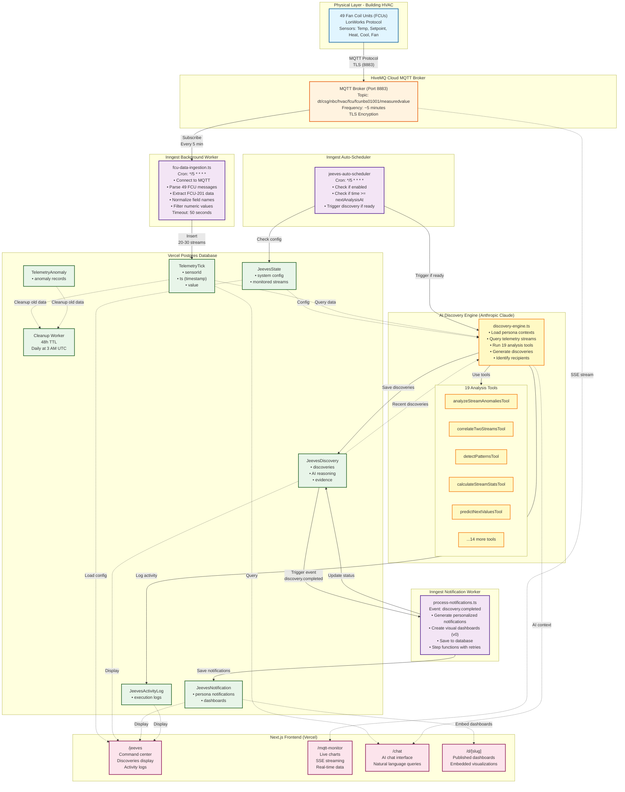
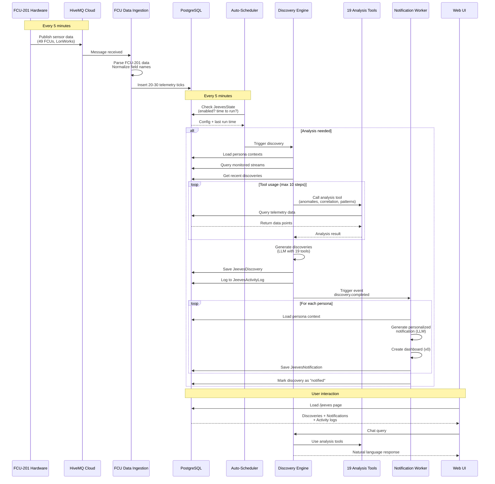
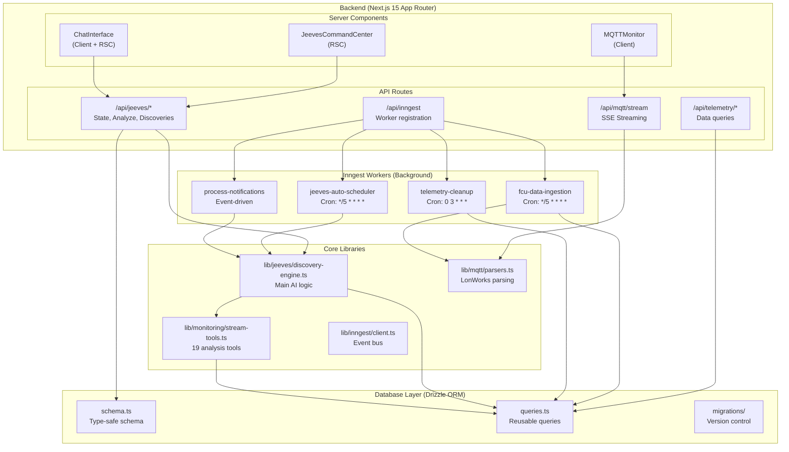
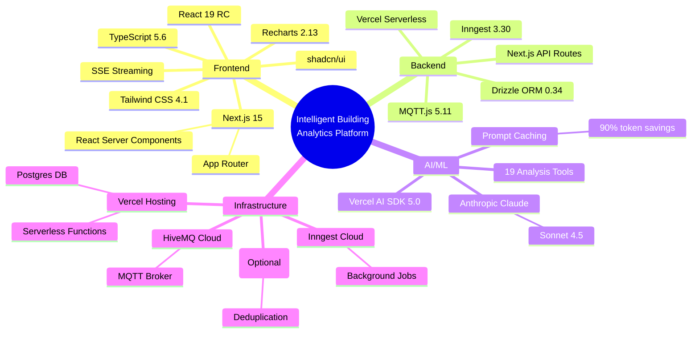
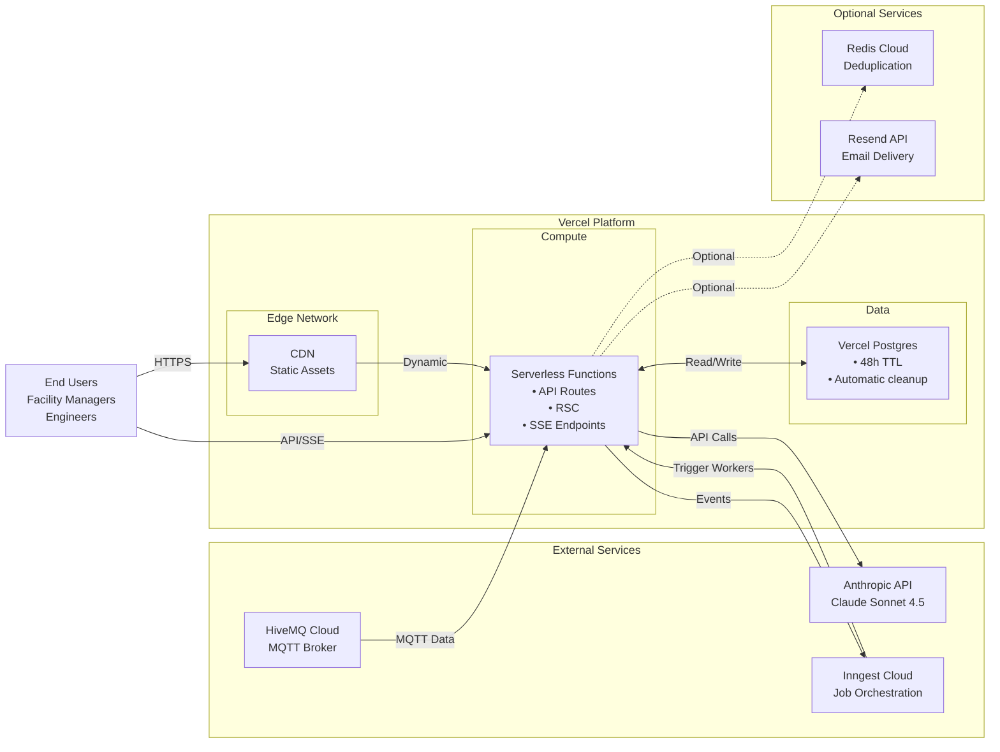

# Intelligent Building Analytics Platform - System Architecture

## Complete System Architecture Diagram

## Data Flow Sequence

## Component Architecture

## Technology Stack

## Deployment Architecture

